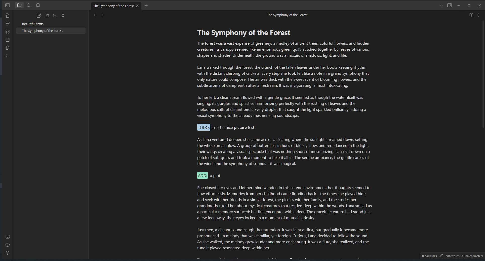
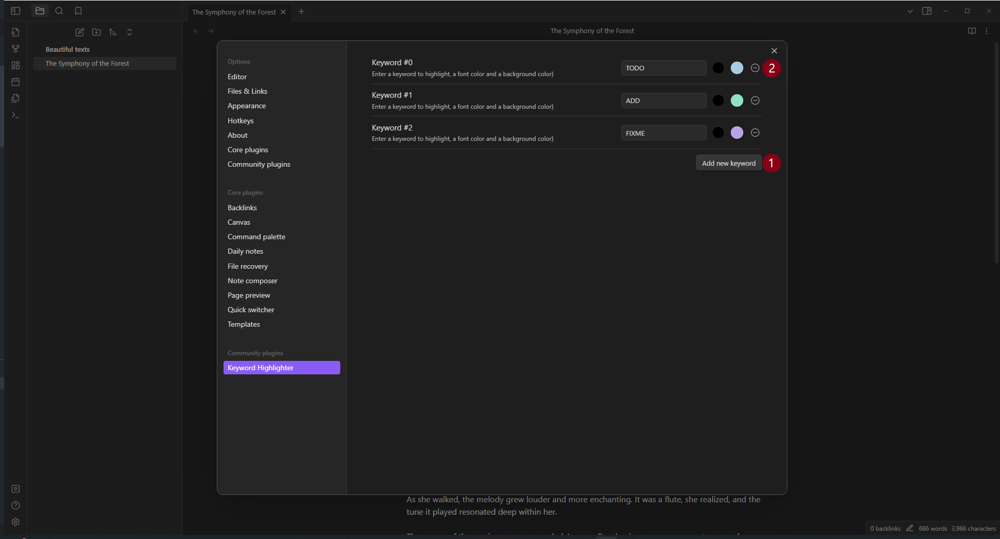

# Keyword Highlighter Plugin

## Overview

The Obsidian Keyword Highlighter is a powerful plugin designed for Obsidian users who wish to enhance their note-taking experience. This plugin allows you to highlight specific keywords in your notes, making it easier to locate and organize important information. It's perfect for researchers, students, and professionals who deal with large volumes of text and need a quick way to identify key concepts.

## How it works

### Use the keyword highlighting

Simply type any configured keyword in your notes and it will be automatically highlighted. There are three predefined keywords: _TODO_, _ADD_, _FIXME_. For example, writing `TODO` or `TODO: prepare a ☕` will both be highlighted.

### Add a new keyword

To add a new keyword just press the button `Add new keyword` (1). Then enter the keyword, followed by the font color and the background color. That's it!

### Edit a keyword

Well, that's easy! Just edit the keyword or the font and background colors.

### Remove a keyword

Easy aswell, just hit the delete button (2).

## Advanced Features

### Case-Sensitive Matching

By default, the plugin matches keywords with exact case sensitivity (e.g., "TODO" will only match "TODO", not "todo" or "Todo"). You can change this behavior in the Global Settings:

1. Open the plugin settings
2. Expand the "Global Settings" section
3. Toggle the "Case-sensitive matching" checkbox

When case-sensitive matching is disabled, keywords will match regardless of case. For example, "TODO" will match "todo", "Todo", "TODO", etc.

### Regular Expression Patterns

For advanced pattern matching, you can use regular expressions instead of simple keywords. To define a regex pattern:

1. Wrap your pattern in forward slashes: `/pattern/`
2. For example: `/TODO|FIXME|NOTE/` will match any of these words

When you create a regex pattern, a visual indicator badge (`.*`) appears next to the keyword number in the settings, making it easy to identify regex-enabled keywords at a glance.

**Examples:**

- `/\b(TODO|FIXME|NOTE)\b/` - Matches any of these words with word boundaries
- `/TASK-\d+/` - Matches "TASK-" followed by any number (e.g., "TASK-123")
- `/\[.*?\]/` - Matches any text within square brackets (non-greedy)

## Installation

This plugin can be accessed and installed directly from the Obsidian Community Plugin Store. Alternatively, for manual installation, simply download the required files and place them in your Obsidian vault's plugins folder.
